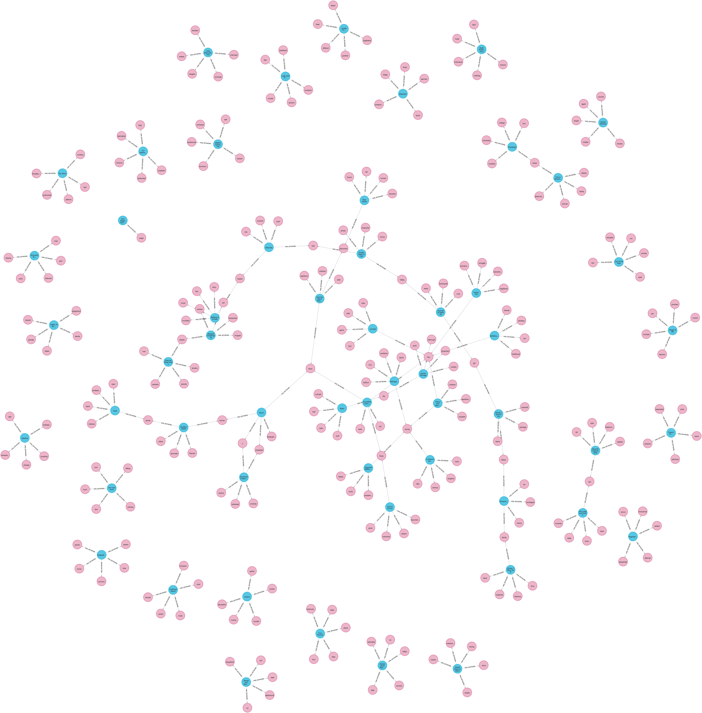

# Personalized Movie Recommendations with Neo4j

## Overview

This project, carried out in a learning context involves building a personalized movie recommendation system using Neo4j, a graph database, to generate real-time recommendations based on movie data. By using a graph-based model, we can offer more relevant, dynamic, and personalized recommendations compared to traditional methods.

The system uses two main recommendation techniques: **Content-Based Filtering** and **Collaborative Filtering**, which are implemented using Cypher queries and Neo4j's graph capabilities.

## Features

1. **Real-time Recommendations**: The use of a graph database enables real-time recommendations, ensuring they are always relevant and up-to-date.
2. **Graph-Based Recommendations**: The system leverages Neo4j's graph model for combining data from multiple sources, such as movies, users, ratings, and genres.
3. **Personalized Recommendations**: The system provides personalized recommendations for each user based on their preferences and interactions with the movie database.
4. **Keyword Extraction**: Leverages NLP techniques with nltk to analyze movie plot descriptions and extract keywords, creating additional connections between movies.
5. **Image Recognition**: Uses image recognition with Google Vision API to analyze movie posters, creating labels that help in enhancing the recommendation quality.

## Data Model

The recommendation system uses a **Labeled Property Graph** model, consisting of nodes, relationships, and properties.

### Nodes
- `Movie`: Represents a movie.
- `Actor`: Represents a movie actor.
- `Director`: Represents a movie director.
- `User`: Represents a user who rates or reviews movies.
- `Genre`: Represents a movie genre.
- `Keyword`: Represents a keyword extracted from a movie's plot description.
- `Label`: Represents a label derived from image recognition of a movie's poster.

### Relationships
- `ACTED_IN`: Relates an actor to a movie.
- `IN_GENRE`: Relates a movie to a genre.
- `DIRECTED`: Relates a director to a movie.
- `RATED`: Relates a user to a movie they have rated.
- `HAS_KEYWORD`: Links a keyword to a movie.
- `HAS_LABEL`: Links a label to a movie.

### Properties
- `title`: The title of the movie.
- `name`: The name of the actor, director, or user.
- `year`: The year of release for the movie.
- `rating`: The rating given by the user.

### Prerequisites

- **Neo4j**: The project utilizes Neo4j's graph database to handle recommendation data. Ensure the Neo4j client is installed and configured.
- **Python**: Required for keyword extraction tasks. Install the NLTK library (`pip install nltk`) and complete any necessary configuration.
- **Google Vision API**: Access to the Google Vision API is needed for image recognition. Set up an account and obtain the necessary credentials.

## Implementation

---
### 1. Queries

A variety of Cypher queries and procedures have been developed to handle different recommendation tasks. These include:

- **Counting Reviews**: Queries to count the number of reviews for specific movies.
- **Finding Similar Items by Genre**: Identifying items similar to a target item based on genre.
- **Collaborative Filtering**: Using collaborative filtering methods to recommend items based on shared user preferences.
- **Similarity Metrics**: Calculating various similarity measures such as:
   - **Jaccard Index**
   - **Cosine Similarity**
   - **Pearson Similarity**
- **k-Nearest Neighbors (kNN)**: Using the kNN algorithm to generate item recommendations based on proximity in feature space.

#### Example 

- CYPHER
```
   // This query recommends movies that similar users have liked but that the target user has not yet rated.
    
    MATCH (targetUser:User {userId: '1'})-[:RATED]->(movie:Movie)<-[:RATED]-(similarUser:User)
    WHERE targetUser <> similarUser
    MATCH (similarUser)-[:RATED]->(recommendedMovie:Movie)
    WHERE NOT EXISTS {
    MATCH (targetUser)-[:RATED]->(recommendedMovie)
    }
    RETURN recommendedMovie.title AS title, COUNT(*) AS commonRatings
    ORDER BY commonRatings DESC
    LIMIT 10
```
- PROC
```
    CALL recommend.collaborativeRecommendations('1')
    YIELD title, commonRatings
    RETURN title, commonRatings
```

### 2. Keyword Extraction

The project includes a Python script that uses the NLTK library to extract keywords from movie plot descriptions. These keywords are then imported into the Neo4j database as nodes and relationships, adding an additional layer of detail to the recommendation system. This allows recommendations to consider plot content and relevant keywords.



### 3. Image Recognition

Using the Google Vision API, the project analyzes movie posters to generate descriptive labels (e.g., "action," "romance," etc.). These labels are then converted into nodes and relationships in Neo4j, enriching the recommendation graph with visual data and enabling recommendations based on poster content.


### 4. Final Query: Personalized Recommendation

The project includes a final, complex query that combines several recommendation techniques to generate a personalized list of recommended items. It incorporates:

- **Temporal Rating Analysis**: Considering the timing of user ratings to suggest trending or popular items.
- **Keyword Analysis**: Utilizing extracted keywords to match user interests with item content.
- **Label Analysis**: Leveraging the image recognition labels for visual similarity and enhanced recommendations.

```cypher
  // Temporal rating + Keyword analysis + Label analysis
  CALL recommend.getRecommendations('Cynthia Freeman')
```

#### Results

|  |  |  |  |
|:-----------------------------------------------------------------------------------------------:|:------------------------------------------------------------------------------------------------------:|:-------------------------------------------------------------------------------------------------------------:|:---------------------------------------------------------------------------------------------------:|
| Forrest Gump                                                                                    | Princess Bride, The                                                                                    | Star Wars: Episode VI - Return of the Jedi                                                                    | Sixth Sense, The                                                                                   |

|  |  |  |  |
|:------------------------------------------------------------------------------------------------:|:--------------------------------------------------------------------------------------------------:|:----------------------------------------------------------------------------------------------------------:|:---------------------------------------------------------------------------------------:|
| Pulp Fiction                                                                                     | Schindler's List                                                                                   | Silence of the Lambs, The                                                                                  | Batman                                                                                  |

## Conclusion

This project demonstrates how Neo4j can be used to create a powerful, graph-based recommendation system for movies. By leveraging both content-based and collaborative filtering techniques, along with similarity metrics like Jaccard, Cosine, and Pearson, the system provides personalized movie recommendations in real-time.

## License

This project use a `Neo4j Procedure Template` which is licensed under the Apache License 2.0 - see the [LICENSE](neo4j-procedure-template-5.x/LICENSE) file for details.

### Apache License 2.0
- **Version 2.0, January 2004**
- You may use, reproduce, and distribute the software under the terms of the Apache License, as specified in the [official license page](http://www.apache.org/licenses/).

For full details on the terms and conditions for use, reproduction, and distribution, please refer to the [Apache License 2.0 documentation](http://www.apache.org/licenses/LICENSE-2.0).
